# Trump's New World: Media Framing in Taiwan

A Comparative Study of the 2024 Election

## Project Context

This project explores how Taiwanese media framed Donald Trump during the 2024 U.S. presidential election by building a full-stack NLP pipeline for large-scale sentiment and framing analysis. We evaluated over 100,000 data and ultimately collected over 7,000 Mandarin-language news articles via authorized web crawling from sources such as UDN, PTS, Liberty Times, and ETtoday, all filtered using the keyword “川普” (Trump). After cleaning and structuring the data with dplyr and exporting to CSV, we used CKIPTagger for Mandarin-specific word segmentation, POS tagging, and named entity recognition.

For the sentiment evaluation, the core aim of the project was to benchmark the labeling and reasoning performance of leading large language models (LLMs) on Mandarin political news. We evaluated several LLMs such as ChatGPT-4o/4.1/o3, LLaMA 3.3, Qwen, and DeepSeek, using two classification frameworks: a single-stage direct sentiment classification, and a two-step reasoning-based labeling process with custom prompts. Accuracy was compared and calculated against human-labeled samples, revealing significant differences across models and prompt strategies.

Eventually, ChatGPT o3 demonstrated the most reliable and consistent performance. All visualizations and analytical results in this project are then based on its labeling output. Our analysis included chi-square tests, topic modeling, and correspondence analysis to reveal ideological patterns and framing biases across media outlets. This project illustrates how LLM-driven NLP workflows can be applied to multilingual media research, providing insight into political discourse and the computational challenges of sentiment modeling in non-English contexts.

## Getting Started

This project analyzes news sentiment regarding Trump using multiple data sources and AI models. Follow the instructions below to set up and run the complete analysis pipeline.


### **Data Sources**

Our research utilizes two primary data sources for comprehensive news analysis:

#### **🏛️ National Development Council (NDC) Open Data Portal**
- **Source Type**: Government authorized data
- **Data Volume**: ~6,000 articles (filtered from over 900,000 articles)
- **Content Filter**: All articles contain keyword "川普" (Trump)
- **Data Quality**: Official government data with high reliability
- **Access Method**: Web scraping through R scripts

#### **📰 UDN Knowledge Database** 
- **Source Type**: Commercial news media
- **Data Volume**: ~1,000 articles with full text
- **Content Filter**: All articles contain keyword "川普" (Trump)
- **Coverage**: Two major news sources
- **Access Method**: Web scraping through Python scripts

#### **📊 Data Structure**
Each collected article contains:
- **Headlines and subheadlines**: Primary content identifiers
- **Full article content**: Complete text for analysis
- **News category/section**: Topic classification
- **Publication date**: Temporal analysis capability
- **Source media outlet**: Origin identification

#### **🗞️ Covered News Sources**
**UDN Group:**
- UDN (聯合報)
- Economic Daily News (經濟日報)

**NDC Sources:**
- PTS News (公視新聞)
- Liberty Times (自由時報)
- ETtoday News (ETtoday 新聞)
- Central News Agency (中央社)


### **AI Models Used**

This project evaluates multiple state-of-the-art language models for sentiment classification:

#### **📋 Model List**
- **OpenAI Models**: ChatGPT-o3, ChatGPT-o1, ChatGPT-o1-mini, ChatGPT-gpt-4o
- **DeepSeek Models**: DeepSeek R1 0528, DeepSeek V3 0324
- **Meta Models**: Llama 3.3 (70B), Llama 3.3 (19B)
- **NVIDIA Models**: Llama 3.1 (253B)
- **Google Models**: Gemma 3 (27B)
- **Microsoft Models**: Phi 4
- **Qwen Models**: Qwen3-235B-A22B, QwQ (32B)
- **Local Models**: Llama-3-Taiwan-70B

#### **🎯 Classification Approaches**

**Single-Stage Classification (Approach 1):**
```python
prompt = (
    "你現在是新聞情緒分類專家，將分類新聞內容對於川普是支持、中立、反對、無關。\n\n"
    "請按照下列標準進行情緒分類：\n\n"
    "中立：對於川普的相關內容，客觀陳述事實，文字平鋪直敘，不帶情緒色彩。\n\n"
    "支持：對於川普的相關內容，正面傳達對川普有利的訊息，或讓讀者對川普產生好印象。例如：強調其政績、領袖特質、正面詞彙、支持者的聲音，或明顯貶低其對手。\n\n"
    "反對：對於川普的相關內容，負面傳達對川普不利的訊息，或讓讀者對川普產生負面印象。例如：強調爭議、負面事件、批評性措辭、引用反對者觀點居多。\n\n"
    "無關：如果內容與川普完全無關。\n\n"
    "請仔細閱讀以下新聞標題及內容，評估這篇新聞對川普的立場，請不要回傳其他文字或標點符號，只回傳支持、中立、反對、無關：\n\n"
    f"新聞標題：{title}\n"
    f"新聞出自：{media}\n"
    f"新聞全文：{news_content}"
)
```

**Two-Stage Reasoning Classification (Approach 2):**

*Step 1: Emotion Sentence Extraction*
```python
prompt_step1 = (
    "你是一位專精於新聞情感分析的AI。你的任務是仔細閱讀以下新聞內容，並專注於找出任何對主要實體「川普」帶有情感色彩的描述。\n\n"
    "請遵循以下指示：\n\n"
    "1.  **識別情感句：** 從新聞文本中，逐句提取所有直接描述「川普」並帶有明顯正面或負面情感（例如：讚揚、批評、喜愛、厭惡、嘲諷、同情等）的句子。請列出這些句子的原文。\n"
    "2.  **中立內容處理：** 如果新聞內容僅為客觀事實陳述，用詞中性，未對「川普」表達任何情感偏向，且可能平衡呈現了不同觀點，請直接回覆「本新聞內容為中立。」，無需列舉句子。\n"
    "3.  **無關內容處理：** 如果新聞內容完全未提及「川普」，或者僅在與新聞主題無關的背景資訊中極其簡略地提及，且該提及不帶任何情感色彩，請直接回覆「本新聞內容為無關。」，無需列舉句子。\n"
    "4.  **輸出格式：**\n"
    "    *   若為情感句，請直接列出原文，每句一行。不要添加任何額外的解釋、編號或評論。\n"
    "    *   若為中立或無關，則按上述指示回覆特定短語。\n\n"
    "請開始分析以下新聞標題與內容："
)

completion = client.chat.completions.create(
    model="o3",  # 使用最新的模型
    messages=[{"role": "system", "content": prompt_step1},
              {"role": "user", "content": f"{title}\n\n{news_content}"}],
    service_tier="flex"
)
```

*Step 2: Sentiment Classification*
```python
prompt_step2 = (
    "你是一位情感分析專家。以下文字是從一篇關於「川普」的新聞中提取出的帶有情感色彩的句子。請基於這些句子，判斷新聞內容對「川普」的整體情感立場。\n\n"
    "請遵循以下指示：\n\n"
    "1.  **判斷立場：** 綜合分析提供的所有句子，判斷整體情感是「支持」川普還是「反對」川普。\n"
    "2.  **簡潔回覆：** 你的回答必須且只能是「支持」或「反對」這兩個詞中的一個。不要包含任何其他文字、解釋、標點符號或空格。\n\n"
    "請分析以下內容並給出你的判斷："
)

senti_completion = client.chat.completions.create(
    model="o3",  # 使用最新的模型
    messages=[{"role": "system", "content": prompt_step2}, 
              {"role": "user", "content": response_content}],
    service_tier="flex"
)
```

### Project Workflow

#### Workflow Diagram

```mermaid
flowchart LR
    subgraph DC ["📊 Data Collection Phase"]
      direction TB
      subgraph NEWS ["News Sources"]
        direction TB
        A1["🏛️ NDC News Collection<br/>(Various Category R Scripts)"] 
        A2["📺 PTS News Collection<br/>(PTSdata.py)"]
        A3["📰 UDN News Collection<br/>(UDNdata.py)"]
      end
      
      A1 --> B1["📄 NDC Articles<br/>ndc_articles.csv"]
      A2 -.-> B2["📄 PTS Articles<br/>pts_articles.csv"]
      A3 --> B3["📄 UDN Articles<br/>udn_articles.csv"]
      
      B2 -.->|Manual Merge| B1
    end
    
    %% Direct connections from Data Collection to branches
    DC --> TP_DIST[ ]
    DC --> SB_DIST[ ]
    DC --> DI_DIST[ ]
    
    subgraph TP ["🔍 Text Processing Branch"]
      direction TB
      TP_DIST -.-> D1["⚙️ CKIP_NDC.R<br/>Chinese NLP Processing"]
      TP_DIST -.-> D2["⚙️ CKIP_UDN.R<br/>Chinese NLP Processing"]
      
      D1 --> E1["📋 NDC Processed<br/>• ndc_articles_POS.csv<br/>• ndc_articles_NER.csv"]
      D2 --> E2["📋 UDN Processed<br/>• udn_articles_POS.csv<br/>• udn_articles_NER.csv"]
    end
    
    subgraph SB ["🎯 Sampling Branch"]
      direction TB
      SB_DIST -.-> F1["🎲 Sample.py<br/>Random Selection<br/>(NDC + UDN Articles)"]
      F1 --> G1["📝 100 Sampled Articles<br/>• ndc_articles_sampled.csv<br/>• udn_articles_sampled.csv"]
      G1 --> H2["🔧 MergeData.R<br/>(Sampling)"]
      H2 --> I2["📊 Sampled Dataset<br/>sampled_articles.csv"]
    end
    
    subgraph DI ["🔗 Data Integration Branch"]
      direction TB
      DI_DIST -.-> H1["🔧 MergeData.R<br/>(Complete Dataset)<br/>(NDC + UDN Articles)"]
      H1 --> I1["📊 Complete Dataset<br/>all_articles.csv"]
    end
    
    %% Manual Analysis entry
    I2 --> MA_DIST[ ]
    
    subgraph MA ["👥 Manual Analysis Phase"]
      direction TB
      MA_DIST -.-> J1["✍️ Manual Labeling<br/>Ground Truth Creation"]
      J1 --> K1["📋 Labelled Dataset<br/>Labelled.csv"]
    end
    
    %% AI Analysis entries
    I1 --> AI_DIST1[ ]
    K1 --> AI_DIST2[ ]
    
    subgraph AI ["🤖 AI Analysis Phase"]
      direction TB
      AI_DIST1 -.-> L1["🚀 AI Analysis<br/>(Complete Dataset)"]
      AI_DIST2 -.-> L2["🚀 AI Analysis<br/>(Labeled Dataset)"]
      
      L1 --> M1["🔧 Label_OneStep.py<br/>Label_TwoSteps.py"]
      L2 --> M2["🔧 Label_OneStep.py<br/>Label_TwoSteps.py"]
      
      M1 --> N1["📈 AI Results<br/>all_articles_results.csv"]
      M2 --> N2["📊 LLMsSCORE<br/>Model Comparison Results"]
    end
    
    %% Final Analysis entries
    E1 --> FA_DIST1[ ]
    E2 --> FA_DIST2[ ]
    N1 --> FA_DIST3[ ]
    N2 --> FA_DIST4[ ]
    
    subgraph FA ["📈 Final Analysis Phase"]
      direction TB
      FA_DIST1 -.-> O1["🔬 Comprehensive Analysis"]
      FA_DIST2 -.-> O1
      FA_DIST3 -.-> O1
      FA_DIST4 -.-> O1
      O1 --> P1["📋 Final Research Results<br/>Combined Insights"]
    end
    
    %% Styling for subgraphs
    style DC fill:#e1f5fe,stroke:#01579b,stroke-width:4px,color:#000
    style NEWS fill:#f0f8ff,stroke:#4682b4,stroke-width:2px,color:#000
    style TP fill:#f3e5f5,stroke:#4a148c,stroke-width:4px,color:#000
    style SB fill:#fff3e0,stroke:#e65100,stroke-width:4px,color:#000
    style DI fill:#e8f5e8,stroke:#1b5e20,stroke-width:4px,color:#000
    style MA fill:#fce4ec,stroke:#880e4f,stroke-width:4px,color:#000
    style AI fill:#fff8e1,stroke:#f57f17,stroke-width:4px,color:#000
    style FA fill:#f1f8e9,stroke:#33691e,stroke-width:4px,color:#000
    
    %% Styling for nodes
    classDef collection fill:#e1f5fe,stroke:#01579b,stroke-width:3px,color:#000,font-size:14px
    classDef processing fill:#f3e5f5,stroke:#4a148c,stroke-width:3px,color:#000,font-size:14px
    classDef sampling fill:#fff3e0,stroke:#e65100,stroke-width:3px,color:#000,font-size:14px
    classDef integration fill:#e8f5e8,stroke:#1b5e20,stroke-width:3px,color:#000,font-size:14px
    classDef manual fill:#fce4ec,stroke:#880e4f,stroke-width:3px,color:#000,font-size:14px
    classDef ai fill:#fff8e1,stroke:#f57f17,stroke-width:3px,color:#000,font-size:14px
    classDef final fill:#f1f8e9,stroke:#33691e,stroke-width:4px,color:#000,font-size:14px
    classDef data fill:#f5f5f5,stroke:#424242,stroke-width:2px,color:#000,font-size:12px
    classDef invisible fill:transparent,stroke:transparent,color:transparent
    
    class A1,A2,A3 collection
    class D1,D2 processing
    class F1 sampling
    class H1,H2 integration
    class J1 manual
    class L1,L2,M1,M2 ai
    class O1 final
    class B1,B2,B3,E1,E2,G1,I1,I2,K1,N1,N2,P1 data
    class TP_DIST,SB_DIST,DI_DIST,MA_DIST,AI_DIST1,AI_DIST2,FA_DIST1,FA_DIST2,FA_DIST3,FA_DIST4 invisible
```



#### Legend
- 📊 **Data Collection**: Gathering news articles from multiple sources
- 🔍 **Text Processing**: NLP processing using CKIP tools
- 🎯 **Sampling**: Random selection for manual analysis
- 🔗 **Data Integration**: Combining all datasets
- 👥 **Manual Analysis**: Human labeling for ground truth
- 🤖 **AI Analysis**: Automated labeling and comparison
- 📈 **Final Analysis**: Comprehensive results synthesis


### **Installation Requirements**

#### **Prerequisites**
- **R**: Version 4.0+ recommended
- **Python**: Version 3.8+ recommended
- **OpenAI API Key**: Required for AI analysis
- **Internet Connection**: Required for data collection and API calls

#### **R Environment**
Make sure you have R installed. Install the required R packages by running the following commands in your R console:

```R
install.packages("readr")       # For reading and writing CSV files
install.packages("rvest")       # For web scraping
install.packages("dplyr")       # For data manipulation
install.packages("stringr")     # For string processing
install.packages("purrr")       # For functional programming
install.packages("httr")        # For HTTP requests
install.packages("progressr")   # For progress bar display
install.packages("reticulate")  # To call Python from R
```

#### **Python Environment**
Ensure you have Python installed (recommended version: 3.8+). Install the required Python packages using `pip`:

```plaintext
pip install openai==1.78.1       # Interaction with OpenAI API
pip install pandas==2.0.3        # Data manipulation
pip install playwright==1.48.0   # Asynchronous browser automation
pip install selenium==4.10.0     # Browser automation
pip install ckiptagger==0.2.1    # Chinese word segmentation
pip install tqdm==4.67.1         # Progress bar display
```

#### **CKIPTagger Setup**
CKIPTagger is essential for Chinese NLP processing. Follow these steps:

1. **Installation**: Follow the official guide at [https://github.com/ckiplab/ckiptagger](https://github.com/ckiplab/ckiptagger)
2. **Model Download**: Download the required pre-trained models as specified in their documentation
3. **Verification**: Test the installation before running the main scripts

#### **API Configuration**
- **OpenAI API**: 
   - Obtain an API key from OpenAI
   - Set the API key in your environment variables
   - Configure rate limits to avoid API quota issues

```python
import openai
client = openai.OpenAI(api_key="your-api-key-here")
```


### **Execution Flow Summary**

```
Data Collection → [Text Processing | Sampling | Data Integration] 
                     ↓              ↓            ↓
                Text Results   Manual Analysis  Complete Dataset
                     ↓              ↓            ↓
                     └──── AI Analysis Phase ────┘
                              ↓
                        Final Analysis
```


### **Important Notes**

- **Parallel Execution**: Phases 2 (Branches A, B, C) can be run in parallel after Phase 1 completion
- **Dependencies**: 
  - Phase 3 (Manual Analysis) requires Branch B (Sampling) completion
  - Phase 4 (AI Analysis) requires Branches B and C completion
  - Phase 5 (Final Analysis) requires all previous phases
- **CKIPTagger Setup**: Ensure CKIPTagger models are properly installed before running text processing scripts
- **API Configuration**: Configure OpenAI API keys before running AI analysis scripts
- **File Management**: Ensure output directories exist and have proper write permissions

### **Expected Outputs**

After completing all steps, you should have:

- **📊 Raw Data**: `ndc_articles.csv`, `udn_articles.csv`, `pts_articles.csv`
- **🔍 Processed Data**: `*_POS.csv`, `*_NER.csv` files with NLP annotations
- **🎯 Sample Data**: `sampled_articles.csv` with 100 selected articles
- **👥 Ground Truth**: `Labelled.csv` with manual sentiment labels
- **🤖 AI Results**: Model performance comparisons and sentiment predictions
- **📈 Final Analysis**: Comprehensive research insights and findings

### **Troubleshooting**

#### **Common Issues**
- **Memory Errors**: Process large datasets in smaller batches
- **API Rate Limits**: Implement delays between API calls
- **Encoding Issues**: Ensure UTF-8 encoding for Chinese text
- **Missing Dependencies**: Verify all packages are properly installed
- **Network Timeouts**: Check internet connection for data collection

#### **Support Resources**
- **CKIPTagger Issues**: Refer to their GitHub repository
- **OpenAI API Problems**: Check OpenAI documentation
- **R Package Issues**: Use `install.packages()` with dependencies=TRUE
- **Python Environment**: Consider using virtual environments

## File Structure

### **Project Directory Structure**

```plaintext
ici_big_data_social_analysis\                  # Project root directory
|
├── .git\                                      # Git version control folder
|
├── LLMsSCORE\                                 # Scores of various LLMs for classifying 100 sampled articles using two prompts
│   ├── [LLM result-related files]
│
├── NDCdata\                                   # NDC news-related data
│   ├── ndc_articles_sampled\                  # Stores full text of 100 randomly sampled articles
│   ├── trump_articles\                        # Stores full text of all categorized news articles
│   ├── trump_articles_POS_TXT\                # Stores WS+POS processed full text of all categorized news articles
│   ├── [News category folders]                # E.g., Cross-Strait News, Breaking News, etc.
│   │   ├── trump_articles\                    # Full text of news articles in the specific category
│   │   ├── trump_articles_[category].R        # Script for scraping and processing news articles in the category
│   │   ├── trump_articles_[category].csv      # Exported news data for the category (output from trump_articles_[category].R)
│   ├── ndc_articles.csv                       # Complete dataset of NDC news (output from CKIP_NDC.R)
│   ├── ndc_articles_NER.csv                   # NER results for NDC news (output from CKIP_NDC.R)
│   ├── ndc_articles_POS.csv                   # WS+POS results for NDC news (output from CKIP_NDC.R)
│   ├── ndc_articles_sampled.csv               # 100 randomly sampled NDC news articles (output from Sample.py)
│   ├── PTSdata.py                             # Script using Playwright to scrape NDC news
│
├── UDNdata\                                   # UDN news-related data
│   ├── trump_articles\                        # Stores full text of all categorized news articles
│   ├── trump_articles_POS_TXT\                # Stores WS+POS processed full text of all categorized news articles
│   ├── udn_articles_sampled\                  # Stores full text of 100 randomly sampled articles
│   ├── udn_articles.csv                       # Complete dataset of UDN news (output from UDNdata.py)
│   ├── udn_articles_NER.csv                   # NER results for UDN news (output from CKIP_UDN.R)
│   ├── udn_articles_POS.csv                   # WS+POS results for UDN news (output from CKIP_UDN.R)
│   ├── udn_articles_sampled.csv               # 100 randomly sampled UDN news articles (output from Sample.py)
│   ├── UDNdata.py                             # Script using Selenium to scrape UDN news
│
├── sample_articles\                           # Stores full text of 100 randomly sampled articles (combined from NDC and UDN)
│
├── all_articles.csv                           # Complete dataset of all news articles (output from MergeData.R)
├── all_articles_results.csv                   # AI model analysis results for all news articles (using OpenAI-o3, output from Label_OneStep.py)
├── sampled_articles.csv                       # 100 randomly sampled articles (output from MergeData.R)
├── Labelled.csv                               # 100 manually labeled news articles
|
├── CKIP_NDC.R                                 # Uses CKIPTagger to analyze NDC news data
├── CKIP_UDN.R                                 # Uses CKIPTagger to analyze UDN news data
├── MergeData.R                                # Combines and processes multiple datasets
|
├── Label_OneStep.py                           # Uses OpenAI API for one-step sentiment and label analysis of news articles
├── Label_TwoSteps.py                          # Uses OpenAI API for two-step sentiment and label analysis of news articles
├── Sample.py                                  # Randomly selects 100 news articles for manual labeling
```

### **File Relationships**

| **Output File**             | **Source Code**              | **Description**                                                                 |
|-----------------------------|-----------------------------|-------------------------------------------------------------------------------|
| `trump_articles_[category].csv` | `trump_articles_[category].R` | Exported news data for each category, including the full text of news articles |
| `ndc_articles.csv`          | `CKIP_NDC.R`               | Complete dataset of NDC news                                                 |
| `ndc_articles_NER.csv`      | `CKIP_NDC.R`               | NER results for NDC news                                                     |
| `ndc_articles_POS.csv`      | `CKIP_NDC.R`               | WS+POS results for NDC news                                                  |
| `ndc_articles_sampled.csv`  | `Sample.py`                | 100 randomly sampled NDC news articles                                       |
| `udn_articles.csv`          | `UDNdata.py`              | Complete dataset of UDN news                                                 |
| `udn_articles_NER.csv`      | `CKIP_UDN.R`              | NER results for UDN news                                                     |
| `udn_articles_POS.csv`      | `CKIP_UDN.R`              | WS+POS results for UDN news                                                  |
| `udn_articles_sampled.csv`  | `Sample.py`                | 100 randomly sampled UDN news articles                                       |
| `sampled_articles.csv`      | `MergeData.R`             | Combined 100 randomly sampled articles from NDC and UDN                      |
| `all_articles.csv`          | `MergeData.R`             | Combined dataset of all NDC and UDN news articles                            |
| `all_articles_results.csv`  | `Label_OneStep.py`        | Sentiment and label analysis results for all news articles using OpenAI-o3   |
| `Labelled.csv`              | Manual labeling           | 100 manually labeled news articles                                           |


## Analysis

### Analysis Methods & Visualizations
We applied a full-stack NLP pipeline and multiple visualization techniques to uncover how Taiwanese media framed Donald Trump during the 2024 U.S. presidential election. Below are the core analyses and their associated insights:

### 🧠 Vocabulary & Framing Patterns


We analyzed word usage across outlets using CKIPTagger-based segmentation. Common patterns included high-frequency personal names (Trump, Biden, Harris) and evaluative terms like believe, may, and state, indicating personalized and subjective media framing.

### 📰 Sentiment by Media Outlet
圖

*We compared sentiment polarity (Supportive / Neutral / Oppositional) using both CSentiPackage and LLM-based labeling. PTS and Liberty Times showed more positive framing, while CNA and ETtoday remained mostly neutral—reflecting ideological variance across the media landscape.*

### 🔍 Statistical Significance of Framing
圖

*A chi-square test revealed statistically significant framing deviations. For instance, PTS had more positive coverage than expected, while ETtoday significantly underrepresented such framing—highlighting bias patterns aligned with outlet orientation.*

### 🕒 Temporal Coverage Trends
圖

*Media attention followed a U-shaped curve: peaking after Biden’s withdrawal (July) and Trump’s victory (November), with a lull mid-campaign. The sharp rise in late October aligned with election momentum and reflected media re-engagement.*

### 📈 Sentiment Shifts Over Time
圖

*Neutral reporting dominated (>75%) throughout the cycle. However, positive sentiment peaked after Trump’s election win, suggesting media shifted tone in response to political outcomes. Negative coverage remained minimal.*

### 🧾 Entity Network Analysis
圖

*Using NER, we observed that PERSON entities (Trump, Harris, etc.) dominated, followed by geopolitical (GPE) and organizational (ORG) terms. This reflects both the personalization of news and its anchoring in global political context.*

### 🤖 LLM Performance Benchmark


We evaluated multiple LLMs (ChatGPT-4o/4.1, DeepSeek, Qwen, LLaMA 3.3, etc.) in both single-stage and multi-stage sentiment classification. ChatGPT and DeepSeek performed best in one-step reasoning, but complex prompts exposed limitations in model reliability and precision across tasks.
## Results

[Provide a summary of your findings and conclusions, including any recommendations or implications for future research. Be sure to explain how your results address your research question or problem statement.]

## Contributors

[List the contributors to your project and describe their roles and responsibilities.]

## Acknowledgments

[Thank any individuals or organizations who provided support or assistance during your project, including funding sources or data providers.]

## References

### Data Sources
UDN Knowledge Database (聯合報資料庫) – via National Development Council Open Data Portal

News articles from:

United Daily News (UDN) / PTS News Network (公視新聞) / Liberty Times (自由時報) / Economic Daily News (經濟日報) / ETtoday News / Central News Agency (CNA)

### Analytical Tools & Methods
Web Crawling & Data Cleaning: 
R with dplyr, CSV conversion

Text Preprocessing: 
CKIPTagger for Mandarin NLP / Word Segmentation (WS) / Part-of-Speech Tagging (POS) / Named Entity Recognition (NER)

Sentiment Analysis Tools:
Custom prompt engineering with multiple LLMs:
ChatGPT (4o, 4.1) / Meta LLaMA 3.3 / DeepSeek R1 / Qwen-3 / Microsoft Phi-4 / Google Gemma 3

### Statistical & Text Analysis
Chi-Square Test for independence / Standardized Residuals (Z-scores) / Topic Modeling / Correspondence Analysis
