# Trump's New World: Media Framing in Taiwan

A Comparative Study of the 2024 Election

## Project Context

This project explores how Taiwanese media framed Donald Trump during the 2024 U.S. presidential election by building a full-stack NLP pipeline for large-scale sentiment and framing analysis. We collected over 7,000 Mandarin-language news articles via authorized web crawling from sources such as UDN, PTS, Liberty Times, and ETtoday, all filtered using the keyword “川普” (Trump). After cleaning and structuring the data with dplyr and exporting to CSV, we used CKIPTagger for Mandarin-specific word segmentation, POS tagging, and named entity recognition.

Sentiment labeling was performed using both traditional NLP tools (e.g., CSentiPackage from Academia Sinica) and a comparative evaluation of leading LLMs (ChatGPT-4o/4.1, LLaMA 3.3, Qwen, DeepSeek). Two evaluation approaches were designed: direct single-stage classification and a two-step reasoning process with custom prompts. We benchmarked accuracy against human-labeled samples, revealing notable variance across models and prompt strategies.

Our analysis included chi-square tests, topic modeling, and correspondence analysis to uncover framing patterns and ideological bias across outlets. This project demonstrates how NLP workflows and LLMs can be integrated for multilingual media analysis, offering insights into geopolitical narrative construction and the challenges of sentiment modeling in non-English contexts.

## Getting Started

[Provide instructions on how to get started with your project, including any necessary software or data. Include installation instructions and any prerequisites or dependencies that are required.]

### Project Workflow

#### Workflow Diagram

```mermaid
flowchart LR
    subgraph DC ["📊 Data Collection Phase"]
      direction TB
      subgraph NEWS ["News Sources"]
        direction TB
        A1["🏛️ NDC News Collection<br/>(Various Category R Scripts)"] 
        A2["📺 PTS News Collection<br/>(PTSdata.py)"]
        A3["📰 UDN News Collection<br/>(UDNdata.py)"]
      end
      
      A1 --> B1["📄 NDC Articles<br/>ndc_articles.csv"]
      A2 -.-> B2["📄 PTS Articles<br/>pts_articles.csv"]
      A3 --> B3["📄 UDN Articles<br/>udn_articles.csv"]
      
      B2 -.->|Manual Merge| B1
    end
    
    %% Direct connections from Data Collection to branches
    DC --> TP_DIST[ ]
    DC --> SB_DIST[ ]
    DC --> DI_DIST[ ]
    
    subgraph TP ["🔍 Text Processing Branch"]
      direction TB
      TP_DIST -.-> D1["⚙️ CKIP_NDC.R<br/>Chinese NLP Processing"]
      TP_DIST -.-> D2["⚙️ CKIP_UDN.R<br/>Chinese NLP Processing"]
      
      D1 --> E1["📋 NDC Processed<br/>• ndc_articles_POS.csv<br/>• ndc_articles_NER.csv"]
      D2 --> E2["📋 UDN Processed<br/>• udn_articles_POS.csv<br/>• udn_articles_NER.csv"]
    end
    
    subgraph SB ["🎯 Sampling Branch"]
      direction TB
      SB_DIST -.-> F1["🎲 Sample.py<br/>Random Selection<br/>(NDC + UDN Articles)"]
      F1 --> G1["📝 100 Sampled Articles<br/>• ndc_articles_sampled.csv<br/>• udn_articles_sampled.csv"]
      G1 --> H2["🔧 MergeData.R<br/>(Sampling)"]
      H2 --> I2["📊 Sampled Dataset<br/>sampled_articles.csv"]
    end
    
    subgraph DI ["🔗 Data Integration Branch"]
      direction TB
      DI_DIST -.-> H1["🔧 MergeData.R<br/>(Complete Dataset)<br/>(NDC + UDN Articles)"]
      H1 --> I1["📊 Complete Dataset<br/>all_articles.csv"]
    end
    
    %% Manual Analysis entry
    I2 --> MA_DIST[ ]
    
    subgraph MA ["👥 Manual Analysis Phase"]
      direction TB
      MA_DIST -.-> J1["✍️ Manual Labeling<br/>Ground Truth Creation"]
      J1 --> K1["📋 Labelled Dataset<br/>Labelled.csv"]
    end
    
    %% AI Analysis entries
    I1 --> AI_DIST1[ ]
    K1 --> AI_DIST2[ ]
    
    subgraph AI ["🤖 AI Analysis Phase"]
      direction TB
      AI_DIST1 -.-> L1["🚀 AI Analysis<br/>(Complete Dataset)"]
      AI_DIST2 -.-> L2["🚀 AI Analysis<br/>(Labeled Dataset)"]
      
      L1 --> M1["🔧 Label_OneStep.py<br/>Label_TwoSteps.py"]
      L2 --> M2["🔧 Label_OneStep.py<br/>Label_TwoSteps.py"]
      
      M1 --> N1["📈 AI Results<br/>all_articles_results.csv"]
      M2 --> N2["📊 LLMsSCORE<br/>Model Comparison Results"]
    end
    
    %% Final Analysis entries
    E1 --> FA_DIST1[ ]
    E2 --> FA_DIST2[ ]
    N1 --> FA_DIST3[ ]
    N2 --> FA_DIST4[ ]
    
    subgraph FA ["📈 Final Analysis Phase"]
      direction TB
      FA_DIST1 -.-> O1["🔬 Comprehensive Analysis"]
      FA_DIST2 -.-> O1
      FA_DIST3 -.-> O1
      FA_DIST4 -.-> O1
      O1 --> P1["📋 Final Research Results<br/>Combined Insights"]
    end
    
    %% Styling for subgraphs
    style DC fill:#e1f5fe,stroke:#01579b,stroke-width:4px,color:#000
    style NEWS fill:#f0f8ff,stroke:#4682b4,stroke-width:2px,color:#000
    style TP fill:#f3e5f5,stroke:#4a148c,stroke-width:4px,color:#000
    style SB fill:#fff3e0,stroke:#e65100,stroke-width:4px,color:#000
    style DI fill:#e8f5e8,stroke:#1b5e20,stroke-width:4px,color:#000
    style MA fill:#fce4ec,stroke:#880e4f,stroke-width:4px,color:#000
    style AI fill:#fff8e1,stroke:#f57f17,stroke-width:4px,color:#000
    style FA fill:#f1f8e9,stroke:#33691e,stroke-width:4px,color:#000
    
    %% Styling for nodes
    classDef collection fill:#e1f5fe,stroke:#01579b,stroke-width:3px,color:#000,font-size:14px
    classDef processing fill:#f3e5f5,stroke:#4a148c,stroke-width:3px,color:#000,font-size:14px
    classDef sampling fill:#fff3e0,stroke:#e65100,stroke-width:3px,color:#000,font-size:14px
    classDef integration fill:#e8f5e8,stroke:#1b5e20,stroke-width:3px,color:#000,font-size:14px
    classDef manual fill:#fce4ec,stroke:#880e4f,stroke-width:3px,color:#000,font-size:14px
    classDef ai fill:#fff8e1,stroke:#f57f17,stroke-width:3px,color:#000,font-size:14px
    classDef final fill:#f1f8e9,stroke:#33691e,stroke-width:4px,color:#000,font-size:14px
    classDef data fill:#f5f5f5,stroke:#424242,stroke-width:2px,color:#000,font-size:12px
    classDef invisible fill:transparent,stroke:transparent,color:transparent
    
    class A1,A2,A3 collection
    class D1,D2 processing
    class F1 sampling
    class H1,H2 integration
    class J1 manual
    class L1,L2,M1,M2 ai
    class O1 final
    class B1,B2,B3,E1,E2,G1,I1,I2,K1,N1,N2,P1 data
    class TP_DIST,SB_DIST,DI_DIST,MA_DIST,AI_DIST1,AI_DIST2,FA_DIST1,FA_DIST2,FA_DIST3,FA_DIST4 invisible
```



#### Legend
- 📊 **Data Collection**: Gathering news articles from multiple sources
- 🔍 **Text Processing**: NLP processing using CKIP tools
- 🎯 **Sampling**: Random selection for manual analysis
- 🔗 **Data Integration**: Combining all datasets
- 👥 **Manual Analysis**: Human labeling for ground truth
- 🤖 **AI Analysis**: Automated labeling and comparison
- 📈 **Final Analysis**: Comprehensive results synthesis

---

### **Installation Requirements**

#### **R Environment**
Make sure you have R installed. Install the required R packages by running the following commands in your R console:

```R
install.packages("readr")       # For reading and writing CSV files
install.packages("rvest")       # For web scraping
install.packages("dplyr")       # For data manipulation
install.packages("stringr")     # For string processing
install.packages("purrr")       # For functional programming
install.packages("httr")        # For HTTP requests
install.packages("progressr")   # For progress bar display
install.packages("reticulate")  # To call Python from R
```

#### **Python Environment**
Ensure you have Python installed (recommended version: 3.8+). Install the required Python packages using `pip`:

```plaintext
pip install openai==1.78.1       # Interaction with OpenAI API
pip install pandas==2.0.3        # Data manipulation
pip install playwright==1.48.0   # Asynchronous browser automation
pip install selenium==4.10.0     # Browser automation
pip install ckiptagger==0.2.1    # Chinese word segmentation
pip install tqdm==4.67.1         # Progress bar display
```

#### **Installing CKIPTagger**
For CKIPTagger, please refer to their official GitHub repository for detailed installation instructions: [https://github.com/ckiplab/ckiptagger](https://github.com/ckiplab/ckiptagger).

Make sure to download the required pre-trained model files as explained in the CKIPTagger documentation.

---

### **Execution Flow Summary**

```
Data Collection → [Text Processing | Sampling | Data Integration] 
                     ↓              ↓            ↓
                Text Results   Manual Analysis  Complete Dataset
                     ↓              ↓            ↓
                     └──── AI Analysis Phase ────┘
                              ↓
                        Final Analysis
```

---

### **Important Notes**

- **Parallel Execution**: Phases 2 (Branches A, B, C) can be run in parallel after Phase 1 completion
- **Dependencies**: 
  - Phase 3 (Manual Analysis) requires Branch B (Sampling) completion
  - Phase 4 (AI Analysis) requires Branches B and C completion
  - Phase 5 (Final Analysis) requires all previous phases
- **CKIPTagger Setup**: Ensure CKIPTagger models are properly installed before running text processing scripts
- **API Configuration**: Configure OpenAI API keys before running AI analysis scripts
- **File Management**: Ensure output directories exist and have proper write permissions

---

### **Troubleshooting**

- **Memory Issues**: For large datasets, consider processing in batches
- **API Rate Limits**: Implement delays between API calls if needed
- **Encoding Issues**: Ensure UTF-8 encoding for Chinese text processing
- **Dependencies**: Verify all required packages are installed before execution


## File Structure

### **Project Directory Structure**

```plaintext
ici_big_data_social_analysis\                  # Project root directory
|
├── .git\                                      # Git version control folder
|
├── LLMsSCORE\                                 # Scores of various LLMs for classifying 100 sampled articles using two prompts
│   ├── [LLM result-related files]
│
├── NDCdata\                                   # NDC news-related data
│   ├── ndc_articles_sampled\                  # Stores full text of 100 randomly sampled articles
│   ├── trump_articles\                        # Stores full text of all categorized news articles
│   ├── trump_articles_POS_TXT\                # Stores WS+POS processed full text of all categorized news articles
│   ├── [News category folders]                # E.g., Cross-Strait News, Breaking News, etc.
│   │   ├── trump_articles\                    # Full text of news articles in the specific category
│   │   ├── trump_articles_[category].R        # Script for scraping and processing news articles in the category
│   │   ├── trump_articles_[category].csv      # Exported news data for the category (output from trump_articles_[category].R)
│   ├── ndc_articles.csv                       # Complete dataset of NDC news (output from CKIP_NDC.R)
│   ├── ndc_articles_NER.csv                   # NER results for NDC news (output from CKIP_NDC.R)
│   ├── ndc_articles_POS.csv                   # WS+POS results for NDC news (output from CKIP_NDC.R)
│   ├── ndc_articles_sampled.csv               # 100 randomly sampled NDC news articles (output from Sample.py)
│   ├── PTSdata.py                             # Script using Playwright to scrape NDC news
│
├── UDNdata\                                   # UDN news-related data
│   ├── trump_articles\                        # Stores full text of all categorized news articles
│   ├── trump_articles_POS_TXT\                # Stores WS+POS processed full text of all categorized news articles
│   ├── udn_articles_sampled\                  # Stores full text of 100 randomly sampled articles
│   ├── udn_articles.csv                       # Complete dataset of UDN news (output from UDNdata.py)
│   ├── udn_articles_NER.csv                   # NER results for UDN news (output from CKIP_UDN.R)
│   ├── udn_articles_POS.csv                   # WS+POS results for UDN news (output from CKIP_UDN.R)
│   ├── udn_articles_sampled.csv               # 100 randomly sampled UDN news articles (output from Sample.py)
│   ├── UDNdata.py                             # Script using Selenium to scrape UDN news
│
├── sample_articles\                           # Stores full text of 100 randomly sampled articles (combined from NDC and UDN)
│
├── all_articles.csv                           # Complete dataset of all news articles (output from MergeData.R)
├── all_articles_results.csv                   # AI model analysis results for all news articles (using OpenAI-o3, output from Label_OneStep.py)
├── sampled_articles.csv                       # 100 randomly sampled articles (output from MergeData.R)
├── Labelled.csv                               # 100 manually labeled news articles
|
├── CKIP_NDC.R                                 # Uses CKIPTagger to analyze NDC news data
├── CKIP_UDN.R                                 # Uses CKIPTagger to analyze UDN news data
├── MergeData.R                                # Combines and processes multiple datasets
|
├── Label_OneStep.py                           # Uses OpenAI API for one-step sentiment and label analysis of news articles
├── Label_TwoSteps.py                          # Uses OpenAI API for two-step sentiment and label analysis of news articles
├── Sample.py                                  # Randomly selects 100 news articles for manual labeling
```

---

### **File Relationships**

| **Output File**             | **Source Code**              | **Description**                                                                 |
|-----------------------------|-----------------------------|-------------------------------------------------------------------------------|
| `trump_articles_[category].csv` | `trump_articles_[category].R` | Exported news data for each category, including the full text of news articles |
| `ndc_articles.csv`          | `CKIP_NDC.R`               | Complete dataset of NDC news                                                 |
| `ndc_articles_NER.csv`      | `CKIP_NDC.R`               | NER results for NDC news                                                     |
| `ndc_articles_POS.csv`      | `CKIP_NDC.R`               | WS+POS results for NDC news                                                  |
| `ndc_articles_sampled.csv`  | `Sample.py`                | 100 randomly sampled NDC news articles                                       |
| `udn_articles.csv`          | `UDNdata.py`              | Complete dataset of UDN news                                                 |
| `udn_articles_NER.csv`      | `CKIP_UDN.R`              | NER results for UDN news                                                     |
| `udn_articles_POS.csv`      | `CKIP_UDN.R`              | WS+POS results for UDN news                                                  |
| `udn_articles_sampled.csv`  | `Sample.py`                | 100 randomly sampled UDN news articles                                       |
| `sampled_articles.csv`      | `MergeData.R`             | Combined 100 randomly sampled articles from NDC and UDN                      |
| `all_articles.csv`          | `MergeData.R`             | Combined dataset of all NDC and UDN news articles                            |
| `all_articles_results.csv`  | `Label_OneStep.py`        | Sentiment and label analysis results for all news articles using OpenAI-o3   |
| `Labelled.csv`              | Manual labeling           | 100 manually labeled news articles                                           |

---


## Analysis

### Analysis Methods & Visualizations
We applied a full-stack NLP pipeline and multiple visualization techniques to uncover how Taiwanese media framed Donald Trump during the 2024 U.S. presidential election. Below are the core analyses and their associated insights:

### 🧠 Vocabulary & Framing Patterns


We analyzed word usage across outlets using CKIPTagger-based segmentation. Common patterns included high-frequency personal names (Trump, Biden, Harris) and evaluative terms like believe, may, and state, indicating personalized and subjective media framing.

### 📰 Sentiment by Media Outlet


We compared sentiment polarity (Supportive / Neutral / Oppositional) using both CSentiPackage and LLM-based labeling. PTS and Liberty Times showed more positive framing, while CNA and ETtoday remained mostly neutral—reflecting ideological variance across the media landscape.

### 🔍 Statistical Significance of Framing


A chi-square test revealed statistically significant framing deviations. For instance, PTS had more positive coverage than expected, while ETtoday significantly underrepresented such framing—highlighting bias patterns aligned with outlet orientation.

### 🕒 Temporal Coverage Trends


Media attention followed a U-shaped curve: peaking after Biden’s withdrawal (July) and Trump’s victory (November), with a lull mid-campaign. The sharp rise in late October aligned with election momentum and reflected media re-engagement.

### 📈 Sentiment Shifts Over Time


Neutral reporting dominated (>75%) throughout the cycle. However, positive sentiment peaked after Trump’s election win, suggesting media shifted tone in response to political outcomes. Negative coverage remained minimal.

### 🧾 Entity Network Analysis


Using NER, we observed that PERSON entities (Trump, Harris, etc.) dominated, followed by geopolitical (GPE) and organizational (ORG) terms. This reflects both the personalization of news and its anchoring in global political context.

### 🤖 LLM Performance Benchmark


We evaluated multiple LLMs (ChatGPT-4o/4.1, DeepSeek, Qwen, LLaMA 3.3, etc.) in both single-stage and multi-stage sentiment classification. ChatGPT and DeepSeek performed best in one-step reasoning, but complex prompts exposed limitations in model reliability and precision across tasks.
## Results

[Provide a summary of your findings and conclusions, including any recommendations or implications for future research. Be sure to explain how your results address your research question or problem statement.]

## Contributors

[List the contributors to your project and describe their roles and responsibilities.]

## Acknowledgments

[Thank any individuals or organizations who provided support or assistance during your project, including funding sources or data providers.]

## References

### Data Sources
UDN Knowledge Database (聯合報資料庫) – via National Development Council Open Data Portal

News articles from:

United Daily News (UDN) / PTS News Network (公視新聞) / Liberty Times (自由時報) / Economic Daily News (經濟日報) / ETtoday News / Central News Agency (CNA)

### Analytical Tools & Methods
Web Crawling & Data Cleaning: 
R with dplyr, CSV conversion

Text Preprocessing: 
CKIPTagger for Mandarin NLP / Word Segmentation (WS) / Part-of-Speech Tagging (POS) / Named Entity Recognition (NER)

Sentiment Analysis Tools:
CSentiPackage by Academia Sinica NLP Lab

Custom prompt engineering with multiple LLMs:
ChatGPT (4o, 4.1) / Meta LLaMA 3.3 / DeepSeek R1 / Qwen-3 / Microsoft Phi-4 / Google Gemma 3

### Statistical & Text Analysis
Chi-Square Test for independence / Standardized Residuals (Z-scores) / Topic Modeling / Correspondence Analysis
